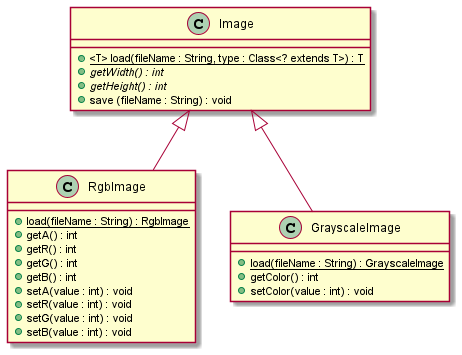

# Simple Image classes in Java

This pack contains very simple and naive implementation of 
for manipulation with images in Java.

All classes are in package `eng.simpleImage`. The package contains of the following classes:
* `Image` - abstract base class for image implementations
* `GrayscaleImage` - representing grayscale image
* `ColorImage` - represents color (RGB) image
* `ImageProcessingException` - represents exception thrown on any issue



# Basic Usage

## New image

For new image, just simply call the constructor of the relevant class and pass the correct width and height.

```java
RgbImage img = new RgbImage(300, 200);

GrayscaleImage img = new GrayscaleImage(300, 200);
```

## Loading & Saving

Color image is converted into grayscale image using simple mean of R-G-B values.

```java
import eng.simpleImage.*;

// color image
RgbImage img = RgbImage.load("c:\temp.jpg");
img.save("C:\out.jpg");

// grayscale image
GrayscaleImage img = GryscaleImage.load("c:\temp.jpg");
img.save("C:\out.jpg");

// universal loading method:
RgbImage img = Image.load("C:\temp.jpg", RgbImage.class);
```

## Working with image

### Generic functions
| Function | Explanation | 
| --- | --- | 
| `int getWidth()` | Returns width as int | 
| `int getHeight()` | Returns height as int | 

### Grayscale image functions
Grayscale image has at every pixel only gray scale value (range 0-255, 0 = black, 255 = white).

| Function | Explanation | 
| --- | --- | 
| int getColor(x, y) | Returns color | 
| -
| void setColor(x, y) | Sets color | 

### RgbImage functions
RGB image is representing the images a red-green-blue channel. Every channel have value in range 0-255 (0 = minimal color intensity, 1 = maximal color intensity).

| Function | Explanation | 
| --- | --- | 
| `int getA(x, y)` | Returns alpha - transparency | 
| `int getR(x, y)` | Returns RED color | 
| `int getG(x, y)` | Returns GREEN color | 
| `int getB(x, y)` | Returns BLUE color | 
| -
| `void setA(x, y)` | Sets alpha- transparency | 
| `void setR(x, y)` | Sets RED color | 
| `void setG(x, y)` | Sets GREEN color | 
| `void setB(x, y)` | Sets BLUE color | 


### Some examples

__Flip image__

```java
// grayscale:
GrayscaleImage src = GrayscaleImage.load("R:\in.jpg");
GrayscaleImage trg = new GrayscaleImage(src.getHeight(), src.getWidth());
for (int i = 0; i < src.getWidth(); i++)
  for (int j = 0; j < src.getHeight(); j++){
    int v;
    v = src.getC(i, j);
    trg.setC(j, i, v);
  }
trg.save("R:\out.jpg");


// color:
RgbImage src = RgbImage.load("R:\in.jpg");
RgbImage trg = new RgbImage(src.getHeight(), src.getWidth());
for (int i = 0; i < src.getWidth(); i++)
  for (int j = 0; j < src.getHeight(); j++){
    int v;
    v = src.getR(i, j);
    trg.setR(j, i, v);
    v = src.getG(i, j);
    trg.setG(j, i, v);
    v = src.getB(i, j);
    trg.setB(j, i, v);
  }
trg.save("R:\out.jpg");
```
